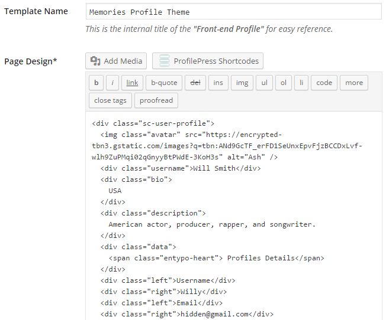
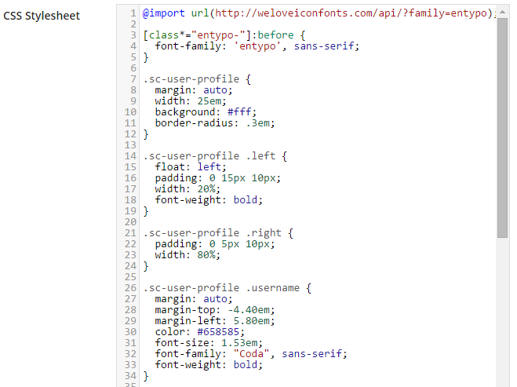
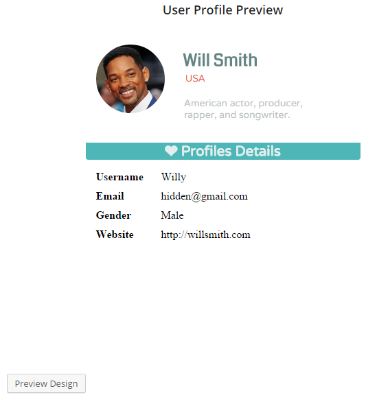
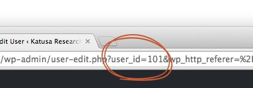

In this tutorial, we'll learn how to build a WordPress front-end user profile (card) with ProfilePress using the template below.


<p data-height="268" data-theme-id="14095" data-slug-hash="qdBVGw" data-default-tab="result" data-user="collizo4sky" class='codepen'>See the Pen <a href='http://codepen.io/collizo4sky/pen/qdBVGw/'>User profile </a> by Agbonghama Collins (<a href='http://codepen.io/collizo4sky'>@collizo4sky</a>) on <a href='http://codepen.io'>CodePen</a>.</p>
<script async src="//assets.codepen.io/assets/embed/ei.js"></script>


Before we go into the tutorial proper, it is worth noting how the front-end user profile works.


The URL to a user profile with username `demo` is accessible via `http://yoursite.com/profile/demo`.
If users are logged in to the site, accessing `http://your site.com/profile/` will reveal their profile.


Click the **Front-end Profile** menu.


Click the `Add New` button.


Enter a name for the user profile card in **Template Name** field.  

The HTML and CSS code for the password-reset form will go into the **Page Design** and **CSS Stylesheet** textareas respectively.








Click the **Preview Design** button to see how the form will look.





The profile component or data will have to be replaced by their ProfilePress [shortcode equivalents](http://profilepress.net/docs/shortcode-api/registration-form/)


Below is the final revision of the Login form code.


```
<div class="sc-user-profile">
  
  <div class="username">[profile-first-name] [profile-last-name ]</div>
  <div class="bio">
    [profile-cpf key="country"]
  </div>
  <div class="description">
    [profile-bio]
  </div>
  <div class="data">
    <span class="entypo-heart"> Profiles Details</span>
  </div>
  <div class="left">Username</div>
  <div class="right">[profile-username]</div>
  <div class="left">Email</div>
  <div class="right">[profile-email]</div>
  <div class="left">Gender</div>
  <div class="right">[profile-cpf key="gender"]</div>
  <div class="left">Website</div>
  <div class="right">[profile-website]</div>
</div>
```


Replace the code earlier entered into the **Page Design** textarea with the revised code above.


Save and then click the `Back to Catalog` button.


Copy its shortcode, paste it to a WordPress page and publish.


Preview the page to see the profile card.

Be sure to [let ProfilePress know about the page containing this profile shortcode](../configuration/front-end-profile.md) if you wish to make it the default profile theme for your website users.


A [live demo](https://profilepress.net/demos/memories-profile-theme/) is available [here](https://profilepress.net/demos/memories-profile-theme/).

If you don't wanna go through the stress of building a custom user profile for your site; happy to inform you that ProfilePress ships with some great looking [profile themes](https://profilepress.net/features/frontend-user-profile-wordpress-plugin/) and also well as [separate themes](https://profilepress.net/downloads/category/front-end-profile/).

## Note

You can display/embed a specific user profile anywhere on your site by adding a `user-id` attribute to the shortcode like so:

```
[profilepress-user-profile id="9" user-id="3"]
```

Where *"9"* is the ID of the user profile theme created and *"3"* the user assigned WordPress ID.

You can get the ID of any user of your site by following the guide below.

* Log into your WordPress admin
* Go to Users > All users
;
* Choose the user and go to his profile
* Look at the URL of the page:
;

The `user_id` argument value in the url gives the actual user ID of that particular user, which is ‘101’ in the current case.
