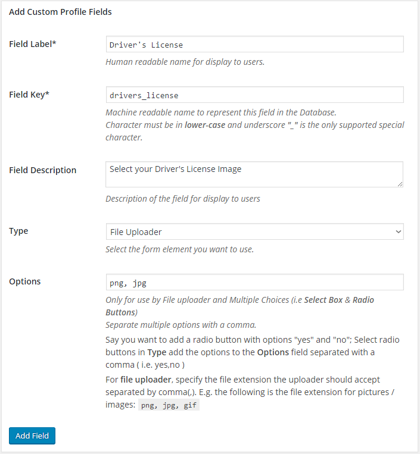
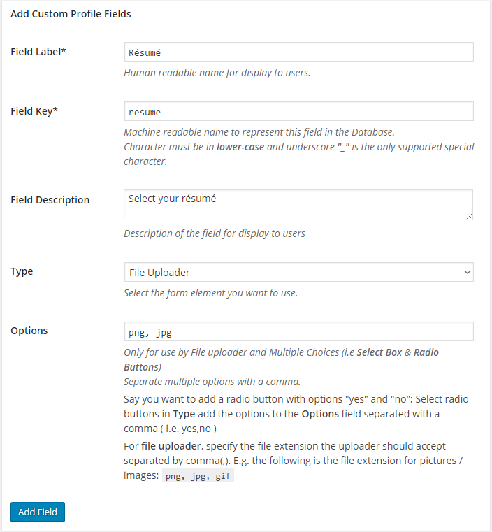
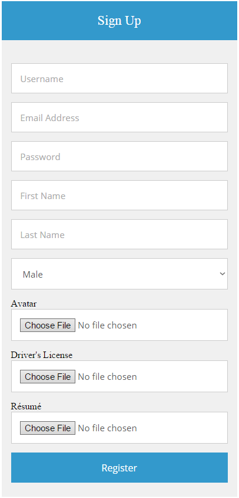
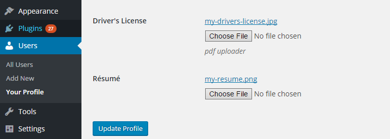

ProfilePress include a file upload features that allows users to upload files during registration, display the files on their [front-end profile](../build/user-profile.md) and ability for them as well as site administrators to edit the uploaded files in  ProfilePress powered edit profile form and default WordPress profile page.

Follow me as I walk us through the set up.

## Creating File Uploader Custom Field
Say we want to allow registering users to upload their drivers license and résumé, it therefore means we'll be creating two file uploader [custom fields](custom-fields.md).

To create the fields, click the `Custom Profile Fields` menu, then the `Add New` button.

Fill out the form as shown in the screenshots below. The form is pretty self-explanatory.






## Adding File Upload Fields to Registration Form

To add the driver's license and résumé file upload fields to a [registration form](../build/registration-form.md), use the `reg-cpf` shortcode like so:

```
[reg-cpf key="drivers_license" type="file"]

[reg-cpf key="resume" type="file"]
```

Below is the inclusion of both fields in [Memories registration theme](http://profilepress.net/downloads/memories-registration-theme/).

```
<div id="sc-register">
  <h1>Sign Up</h1>
  <div class="sc-container">
    [reg-username title="Username" placeholder="Username"]
    [reg-email title="Email Address" placeholder="Email Address"]
    [reg-password title="Password" placeholder="Password"]
    [reg-first-name title="First Name" placeholder="First Name"]
    [reg-last-name title="Last Name" placeholder="Last Name"]
    [reg-cpf key="gender" type="select" title="Gender"]
    Avatar[reg-avatar]

    Driver's License[reg-cpf key="drivers_license" type="file"]
    Résumé[reg-cpf key="resume" type="file"]

    [reg-submit value="Register"]
  </div>
</div>
```

And here is its preview.




## Displaying Uploaded Files in Front-end Profile

The shortcode `[profile-file]` displays a link to a user uploaded file in [front-end profile](../build/user-profile.md).

Say a user used the registration form above and uploaded their driver's license and résumé. The shortcodes below will output a link to the file when used in ProfilePress front-end profile.

```
[profile-file key="drivers_license"]

[profile-file key="resume"]
```

What if you just want the URL of the files. This can come in handy when the uploaded file is an image and you would want to display the image with rather than link to it.

The above can be achieved with the `[profile-file]` shortcode like so:

```

```


## Editing Uploaded Files

As administrator, you can edit (override) a user uploaded file via the WordPress default profile page.




Users can also edit their uploads in WordPress default profile page as well as ProfilePress powered [edit profile forms](../build/edit-profile.md)


Use the `[edit-profile-cpf]` shortcode to include the file upload field to the front-end edit profile form like so:


```
[edit-profile-cpf key="drivers_license" type="file"]

[edit-profile-cpf key="pdf" type="resume"]
```
