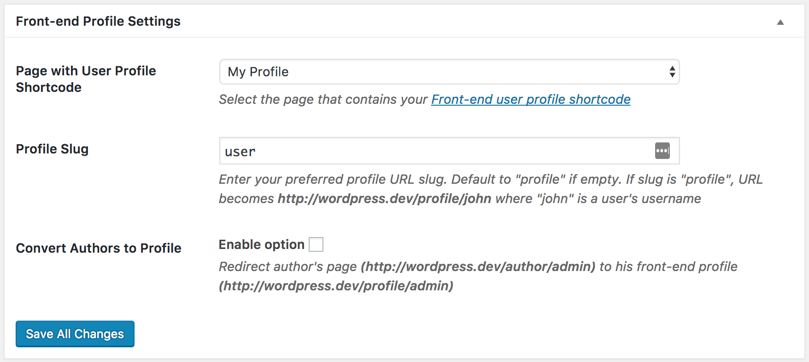

After building a WordPress [custom front-end user profile](../build/user-profile.md), inserted the generated shortcode into a published page, we still need to inform ProfilePress about the page that contains the profile shortcode so it knows what page to use in rendering the front-end profile.

If this isn't done, users profile won't be accessible via the url `http://yoursite.com/profile/username` where *http://yoursite.com* is your website username and *username* is a user's username.

See the succinct guide below on how to get it done.

* Click the `Settings` menu item.

* Under **Front-end Profile Settings** section, select the page with the profile shortcode in *Page with User Profile Shortcode* and save.

* To change the profile slug from "profile" to say "user", enter it to the **Profile Slug** text field.

Finally, flush the rewrite rule by navigating to **Settings > Permalinks** and clicking the Save Changes button.

When the profile url (http://yoursite.com/profile/username) is visited, ProfilePress will used the page that was set above to render the profile page.

To redirect WordPress author page of users to their front-end profile, tick the **Convert Authors to Profile** checkbox.
