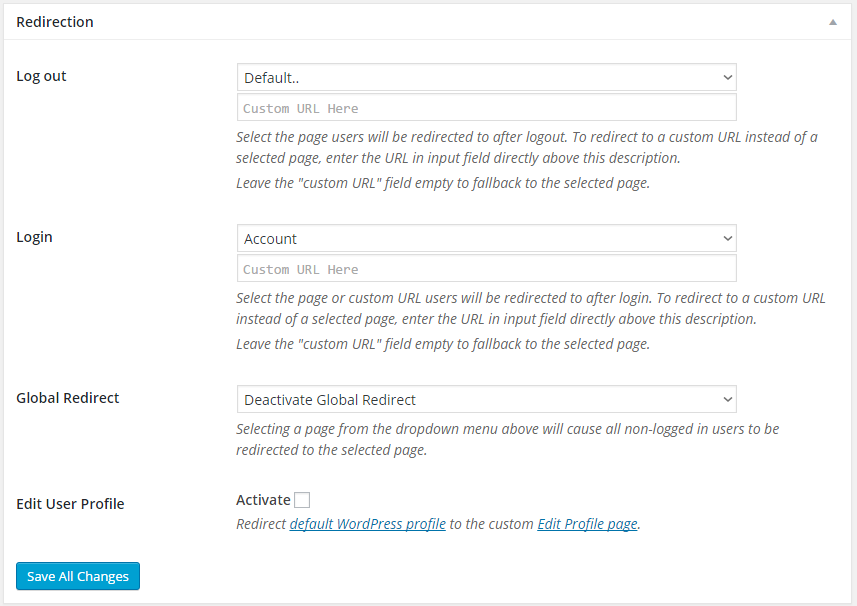
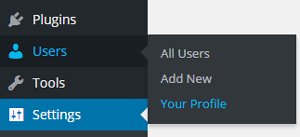

When ProfilePress is [installed and activated](../installation.md), the custom pages it create for login, registration and password reset are automatically set as WordPress default. Thus when a users visit the following URLs:

* http://yoursite.com/wp-login.php
* http://yoursite.com/wp-login.php?action=register
* http://profilepress.net/wp-login.php?action=lostpassword

They will be redirect to the page containing the custom login, registration and password reset form created by ProfilePress.

**An example:** click [http://profilepress.net/wp-login.php](http://profilepress.net/wp-login.php) and you will be redirected to the website custom login page.

To alter these pages settings, click the **Settings** ProfilePress menu and go to the `Global Settings` section.

## User Redirections

To redirect users to a custom page or URL after they log in and log out, select the pages or enter the URL in `Redirection` section and save.

**Note:** URL entered into the custom URL field takes precedence over a selected page.

If you've created a custom [edit profile page](../build/edit-profile.md) and want users to be redirected to the page when they click the `Your Profile` link in WordPress dashboard, check the activate checkbox of **Edit User Profile**.

## Custom Redirections

Starting from version 1.1.0, custom redirect can now be set per login and registration shoortcodes via the `redirect` attribute.

For example, a custom login page with the shortcode  
`[profilepress-login id="2" redirect="http://xyz.com/welcome"]` will redirect users to the URL **http://xyz.com/welcome** after they are logged in.

Similarly, a registration page with the shortcode `[profilepress-registration redirect="http://xyz.com/welcome"]` will log users in and redirect them to the **http://xyz.com/welcome** after they successfully create an account.

How about if you wish to redirect unregistered or non-logged in users to your website login page when they try to access a post or page; simply insert the shortcode `[pp-redirect-non-logged-in-users]` to the said post or page.

if you want them redirected to a custom URL, use the shortcode as like so:

`[pp-redirect-non-logged-in-users url="htp://yourwebsite.com/custom-url-slug"]`

To redirect only logged in users to a custom url, use the shortcode `pp-redirect-logged-in-users` like so:

`[pp-redirect-logged-in-users url="htp://yourwebsite.com/custom-url-slug"]`

Remember, if the user isn’t logged in, no redirection will occur. And omitting the `url` attribute will cause the user to be redirected to the login page.

