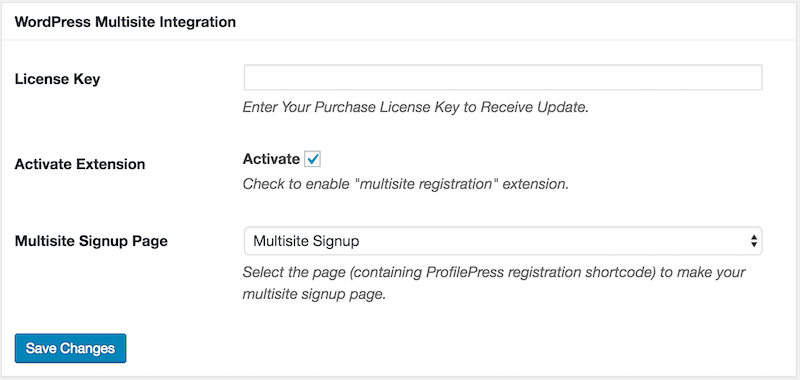
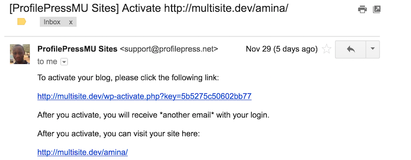

The [WordPress Multisite](http://profilepress.net/downloads/multisite) extension allows you to create a [front-end registration form](../build/registration-form.md) whereby registering users can create new sites in your WordPress Multisite Network. Similar to how WordPress.com allows users to create their own site.

To get this working, ensure you have the [extension](https://profilepress.net/downloads/multisite/) together with [ProfilePress premium](http://profilepress.net/pricing/) installed and activated and that your website is a [WordPress Multisite](https://codex.wordpress.org/Create_A_Network).

When installed and activated, click the **Extras** ProfilePress menu link.


At the **Multisite Integration** section, enter your purchase [license key](http://profilepress.net/downloads/multisite/) to receive plugin updates and check the **Activate Extension** checkbox to enable the extension.


In **Multisite Signup Page**, select the page containing the [ProfilePress registration](../build/registration-form.md) form shortcode you wish to make the signup page of your multisite network. By so doing, all visit to the default Multisite signup page at  `http://yoursite.com/wp-signup.php` will be redirected to the selected page.




See the section below to learn how to make a ProfilePress registration form allow users to create their own site within your multisite network.


## Enabling Site Creation in ProfilePress Signup Form 

Edit the registration form you wish to make your multisite registration page and add the shortcodes for `site address` and `site title` to it. It's that simple.


The shortcodes for site address and site title fields are as follows:

* `[reg-site-address placeholder="Site Address"]`
* `[reg-site-title placeholder="Site Title"]`

Say your chosen registration form is the [memories theme](https://profilepress.net/downloads/memories-registration-theme/), below is how the **Registration Design** code will be.

```
<div id="sc-register">
  <h1>Sign Up</h1>
  <div class="sc-container">
    [reg-username title="Username" placeholder="Username"]
    [reg-email title="Email Address" placeholder="Email Address"]
    [reg-password title="Password" placeholder="Password"]
    [reg-first-name title="First Name" placeholder="First Name"]
    [reg-last-name title="Last Name" placeholder="Last Name"]
    <label for="siteAddress">multisite.dev/</label>
    [reg-site-address id="siteAddress" placeholder="Site Address"]
    [reg-site-title placeholder="Site Title"]
    [reg-submit value="Register"]
  </div>
</div>
```

If yours is a <strong>sub-domains type</strong> (a domain-based network in which on-demand sites use subdomains), move the site address label beneath the input field to reflect it. That is:

```
<label for="siteAddress">multisite.dev/</label>
[reg-site-address id="siteAddress" placeholder="Site Address"]
```

Becomes

```
[reg-site-address id="siteAddress" placeholder="Site Address"]
<label for="siteAddress">.multisite.dev</label>
```

And below is how the form will now look.


Note: you can use any input attribute in the above shortcodes such as "title", "class", "id" etc.

With the above field added to the registration form; an email will be sent to users for them to activate their site after successful registration.



<a href="https://profilepress.net/downloads/multisite/?ref=multisite_doc">
 <div class="buy-now-green">
      <strong>Buy Multisite Integration</strong>
 </div>
</a>

