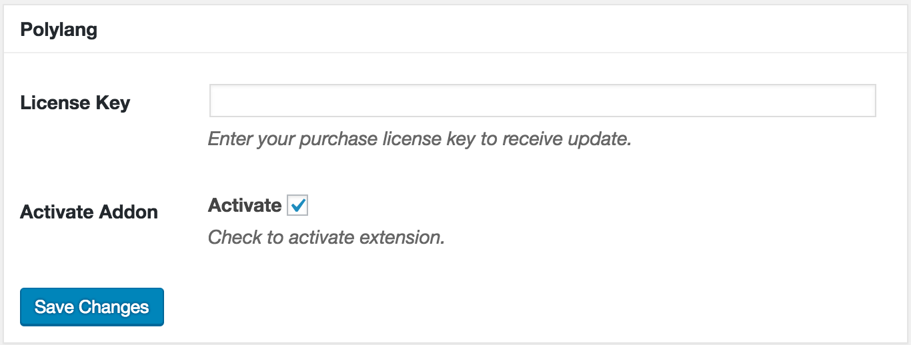

The [Polylang](http://profilepress.net/downloads/polylang) extension integrates ProfilePress with Polylang WordPress plugin thereby allowing your website to have multilingual login, registration, password reset, edit profile forms as well as front-end profile display.

To get this working, ensure you have the [extension](http://profilepress.net/downloads/polylang/) together with [ProfilePress premium](http://profilepress.net/pricing/) installed and activated.

When installed and activated, click the **Extras** ProfilePress menu link.

At the **Polylang** section, enter your purchase [license key](http://profilepress.net/downloads/polylang/) to receive plugin updates and check the **Activate Addon** checkbox to enable the extension.

## How it Works

Assuming we are building a multilingual login form page for WordPress.

Create a page and insert your desired [ProfilePress login form shortcode](../build/login-form.md) to it and save. Then also create translated pages for all languages supported by your multilingual website as described in this documentation.

When visitors and users are viewing your website in a given language and try to login, they get that language translated login page.

The above procedure is also applicable in building multilingual registration, password reset, edit profile forms as well as front-end profile.

All ProfilePress form pages links are automatically updated to point to visitors / user’s language of choice pages.

<a href="http://profilepress.net/downloads/polylang/?ref=polylang_doc">
 

      <strong>Buy Polylang Extension</strong>
 

</a>

