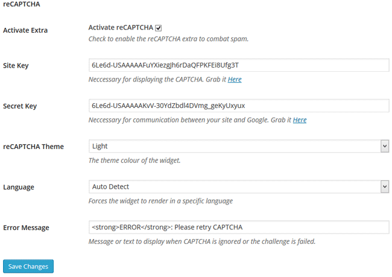

[reCAPTCHA](https://www.google.com/recaptcha) is a free CAPTCHA service that helps protect websites against spam, abuse, malicious registrations and other forms of attacks where computers try to disguise themselves as a human.

A **CAPTCHA** is a test to tell human and bots apart. It is easy for humans to solve, and pretty difficult for bots and other malicious software to figure out. By adding reCAPTCHA to a site, you can block automated software while helping your welcome users to enter with ease.

Recently, the Google security team announced a new version called [No CAPTCHA reCAPTCHA](http://googleonlinesecurity.blogspot.com/2014/12/are-you-robot-introducing-no-captcha.html) that simply requires a check to a checkbox to differentiate humans from spammers.

To protect login, registration, password reset and edit profile forms created by [ProfilePress](http://profilepress.net/pricing/) against spam and abuse using the new `No CAPTCHA reCAPTCHA`, see the guide below.

### Setting up reCAPTCHA

Firstly, you need to grab a reCAPTCHA site and secret key for your website domain. [Get them here](https://www.google.com/recaptcha/admin).

Click the **Extras** ProfilePress menu go to the reCAPTCHA section.

Check the **Activate reCAPTCHA** checkbox, enter your domain site and secret key, select a theme and language and enter the error message to display when the CAPTCHA test is ignored or failed.

### Display the CAPTCHA in ProfilePress forms

Add the shortcode `[pp-recaptcha]` to to wherever you want the CAPTCHA to be displayed in the ProfilePress created (login, registration, password reset & edit profile) forms. Preferably before the submit button.

Want to see a demo? check out the [login page](http://profilepress.net/login/) of ProfilePress website.
