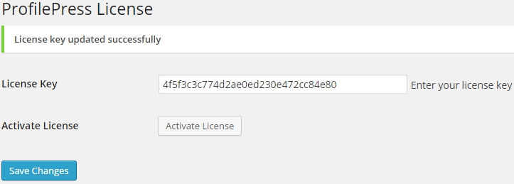

Firstly, ensure you've [installed and activated](installation.md) [ProfilePress plugin](http://profilepress.net/pricing/) before reading this guide.

ProfilePress is quick and easy to set up. No tearing out of hair, we promise.

To get ProfilePress up-and-running; click the `License` plugin menu, enter your license key (that was mailed to you) to the `License Key` field and hit the `Save Changes` button.

After saving the license key, click the `Activate License` button.

If license is valid, you will see a notice to that effect.

Mind you; on activation, ProfilePress will create five pages that will serve as the login, registration, password reset, edit profile and front-end profile page of your WordPress site with the pages containing their respective shortcodes.

ProfilePress ships with a number of themes for each category but the templates with name `Smiley` is chosen by default for the login, registration, password reset, edit profile and front-end profile page.

You are free to switch themes at any time. Simply copy the shortcode of say a different login template and paste it in the page you wish to make your website custom login.

The following will be the URL for the custom login, registration, password reset, edit profile and front-end profile page.

* Log in: `http://yoursite.com/log-in/`
* Registration or sign up: `http://yoursite.com/sign-up/`
* Password Reset: `http://yoursite.com/reset-password/`
* Front-end edit profile: `http://yoursite.com/edit-profile/`
* Front-end user profile: `http://yoursite.com/profile/username`

Henceforth, all visit to the default WordPress login, registration and password reset page will be redirected to their respective custom pages created with ProfilePress.

Users will also be redirected to the custom edit profile form page when they click or visit the default WordPress profile that has the following URL `http://yoursite.com/wp-admin/profile.php`.

The **send users welcome message** that will send an email to newly registered users is also activated by default.
