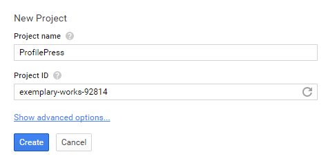
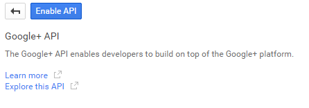
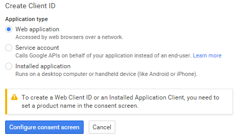
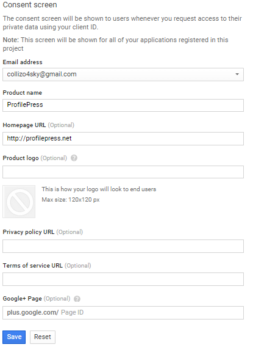

Log in to [Google Developers Console](https://console.developers.google.com/project) using your Google's account, click on the **Create Project** button and fill the form to create a project.





Click the newly created project to go to its dashboard.


Click the **API** sub-menu beneath **APIs & auth** and the click **Google+ API** link in **Social APIs** section.


Click the `Enable API` button to activate it.





To get the `Client ID` and `Client Secret` keys, click the `Credentials` navigation link beneath  **APIs & auth**,


Click the `Create new Client ID` button and a popup page will be displayed.  
On the popup, click the `Configure consent screen`




Fill out the consent screen form and save.





At the client ID form, enter your website URL in the **Authorized JavaScript origins** field and the code below into the **Authorized redirect URIs**

```
http://yoursite.com/wp-content/plugins/profilepress/social-login/?hauth.done=Google
```


Change `http://yoursite.com` to your website URL.


Click the `Create Client ID` submit button. You will see the application credentials displayed as shown in the image below.


Copy and paste the `Client ID` and `Client secrete` to the appropriate field in [Social Login](configuration.md) settings page.
