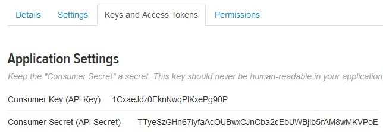

Log in to Twitter [developer center](https://dev.twitter.com/) using your Twitter account and navigate to the [Application Management](https://apps.twitter.com/) console.

Click on the **Create New App button** to initiate the Twitter application creation.

Fill the form and click the submit button to create the application.

Below are the form fields and their description.

**Name:** Display name of your application. Also use during user authentication.

**Description:** A short description of your website.

**Website:** The full URL of your website. (prefixed with `http://` or `https://`)

**Callback URL:** `http://yoursite.com/wp-content/plugins/profilepress/social-login/`.  
Replace `http://yoursite.com` with your website URL. If your website url contains "www", don't forget to include it in the Callback URL.

Read and agree to the *Developer Agreement* and finally, click the create button.

We're now done creating the application.

To get the application consumer key and secret needed by ProfilePress, navigate to the API Keys tab.

The API key and API secret is also referred to as the consumer key and consumer secret, respectively.

Although not needed by ProfilePress, the access token and access token secrets are used by Twitter for users authentication.

To get these tokens; still at the API Keys tab, scroll downward and click on the `Create my access token` button.

Refresh the page and the application tokens will be shown to you.

Copy and save the `API keys` and `API secret` to the appropriate fields in ProfilePress [Social Login](configuration.md) plugin page.
